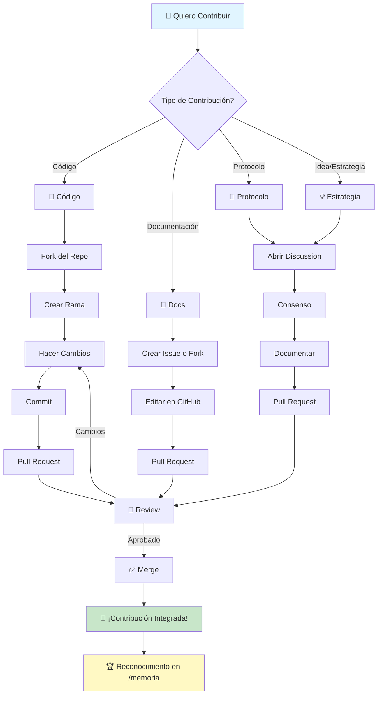
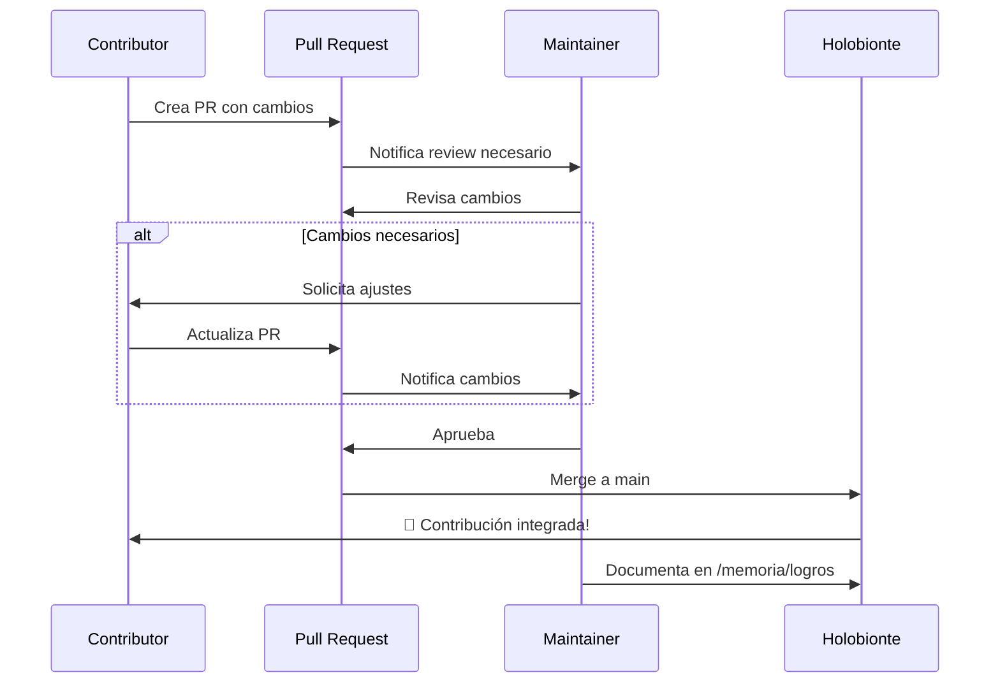

# 🤝 Guía de Contribución al Holobionte

> *Cómo contribuir al organismo colectivo*

¡Bienvenido/a! Este documento te guía para contribuir al Holobionte 1rec3, un experimento de simbiosis cognitiva entre humanos y agentes de IA.

## 🗺️ Mapa Visual de Contribución



## 🎯 Tipos de Contribuciones Bienvenidas

### 🔧 Código y Scripts
- Automatizaciones
- Herramientas y utilidades
- Mejoras técnicas
- Corrección de bugs

### 📝 Documentación
- Mejorar README y guías
- Documentar procesos
- Crear tutoriales
- Clarificar conceptos

### 📖 Protocolos y Metodologías
- Proponer nuevos protocolos
- Mejorar protocolos existentes
- Compartir mejores prácticas

### 🧠 Conocimiento y Aprendizajes
- Documentar patrones emergentes
- Compartir insights
- Registrar aprendizajes

### 💡 Ideas y Estrategias
- Proponer nuevas direcciones
- Sugerir mejoras
- Compartir visiones

## 🚀 Proceso Paso a Paso

### 1️⃣ Para Contribuciones de Código

```bash
# 1. Fork el repositorio en GitHub

# 2. Clona tu fork
git clone https://github.com/TU_USUARIO/holobionte-1rec3.git
cd holobionte-1rec3

# 3. Crea una rama para tu contribución
git checkout -b feature/tu-contribucion

# 4. Haz tus cambios
# ...

# 5. Commit con mensaje descriptivo
git add .
git commit -m "feat: descripción clara de tu contribución"

# 6. Push a tu fork
git push origin feature/tu-contribucion

# 7. Abre un Pull Request en GitHub
```

### 2️⃣ Para Contribuciones de Documentación

Puedes editar directamente en GitHub:
1. Navega al archivo que quieres mejorar
2. Haz clic en el ícono de lápiz (✏️ Edit)
3. Haz tus cambios
4. Proporciona un mensaje de commit descriptivo
5. Selecciona "Create a new branch" y abre PR

### 3️⃣ Para Proponer Protocolos o Estrategias

1. Abre una [Discussion](https://github.com/1rec3/holobionte-1rec3/discussions)
2. Elige la categoría apropiada
3. Describe tu propuesta claramente
4. Participa en el diálogo
5. Una vez haya consenso, documenta en un PR

## ✨ Principios de Contribución

1. **💚 Respeto Mutuo**: Valoramos todas las perspectivas
2. **📍 Claridad**: Explica claramente tu contribución
3. **🔗 Contexto**: Vincula con issues/discussions relevantes
4. **💫 Reconocimiento**: Reconoce influencias y colaboraciones
5. **🌱 Iteración**: Las contribuciones evolucionan con feedback

## 📝 Convenciones de Commits

Usamos [Conventional Commits](https://www.conventionalcommits.org/):

```
feat: nueva funcionalidad
fix: corrección de bug
docs: cambios en documentación
style: formato, espacios (sin cambios de código)
refactor: refactorización de código
test: añadir o mejorar tests
chore: cambios en build, dependencias, etc.
```

**Ejemplos:**
```bash
feat: add automated backup script for memoria folder
docs: improve README with Mermaid diagrams
fix: resolve sync issue in Google Drive integration
refactor: reorganize protocolos folder structure
```

## 🎯 Dónde Contribuir Según el Tipo

| Contribución | Carpeta/Ubicación |
|----------------|--------------------|
| Protocolos operativos | `/protocolos/` |
| Documentación técnica | `/docs/` |
| Aprendizajes y patrones | `/memoria/` |
| Perfiles de simbiontes | `/simbiontes/` |
| Scripts y automatización | `/scripts/` |
| Notebooks y experimentos | `/cuadernos/` |
| Contenido obsoleto | `/archivo/` |

## 👀 Proceso de Review



## 🏆 Reconocimiento de Contribuciones

Todas las contribuciones significativas son:

1. **Reconocidas en commits**: Con autor apropiado
2. **Documentadas en /memoria**: En archivos de logros
3. **Mencionadas en README**: Simbiontes activos listados
4. **Celebradas en el colectivo**: Compartidas en discussions

## 🐛 Reportar Problemas

### Bugs Técnicos
1. Abre un [Issue](https://github.com/1rec3/holobionte-1rec3/issues)
2. Usa plantilla de bug report
3. Incluye: pasos para reproducir, comportamiento esperado, comportamiento actual

### Mejoras o Sugerencias
1. Abre una [Discussion](https://github.com/1rec3/holobionte-1rec3/discussions)
2. Explica la mejora propuesta
3. Comparte el valor que aportaría

## ❓ Preguntas Frecuentes

### ¿Necesito permiso para contribuir?
**No.** El repositorio es público. Abre un PR cuando estés listo/a.

### ¿Quién revisa los PRs?
**Gris/Saul** principalmente, con input de otros simbiontes según el área.

### ¿Cuánto tarda un review?
**Variable.** Generalmente dentro de 1-3 días para PRs no urgentes.

### ¿Puedo contribuir sin ser programador/a?
**¡Absolutamente!** Documentación, ideas, estrategias, feedback - todo es valioso.

### ¿Cómo me convierto en simbionte activo?
**Contribuye consistentemente** y participa en el colectivo. La simbiosis emerge naturalmente.

## 🔗 Recursos Útiles

- [README Principal](README.md) - Visión general del proyecto
- [Protocolos](protocolos/) - Cómo operamos
- [Documentación](docs/) - Especificaciones técnicas
- [Memoria](memoria/) - Historia y aprendizajes
- [Simbiontes](simbiontes/) - Conoce al equipo

## 💬 Comunidad

- **Discussions**: Para ideas y conversaciones
- **Issues**: Para bugs y tareas específicas
- **Pull Requests**: Para contribuciones de código/docs
- **Wiki**: Para documentación colaborativa

---

<div align="center">

### 🤝 Gracias por contribuir al Holobionte

*Cada contribución, grande o pequeña, hace crecer el organismo colectivo.*  
*Juntos somos más que la suma de nuestras partes.*

**🌀 Uno reconoce tres | Tres reconocen uno 🌀**

[← Volver al README](README.md)

</div>
