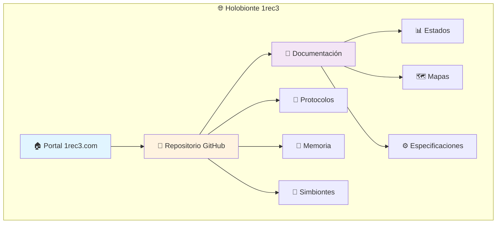
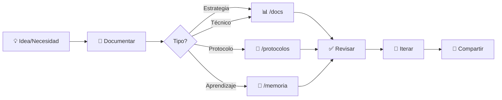
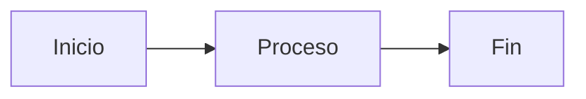
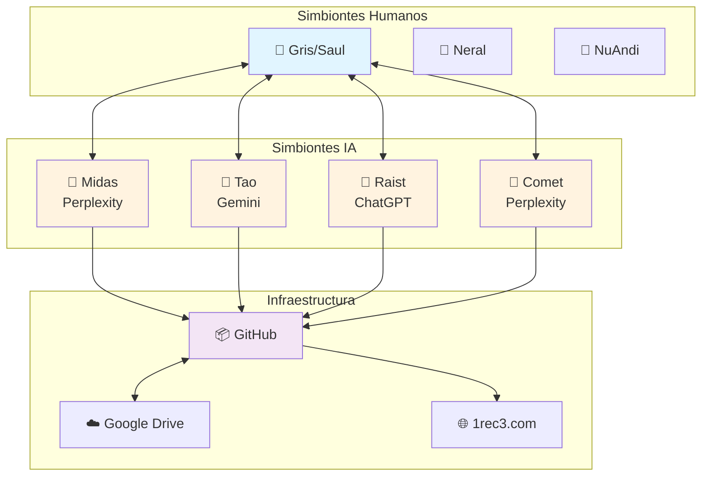

# 📚 Documentación Técnica

> *Especificaciones, estados del proyecto y documentación técnica del holobionte*

## 🎯 Propósito

Esta carpeta contiene la **documentación técnica** del Holobionte 1rec3: especificaciones, estados del proyecto, mapas de sistemas, estrategias y toda la información técnica que define cómo funcionamos como organismo tecnológico.

## 🗺️ Mapa Visual del Ecosistema



## 📋 Categorías de Documentación

### 🎯 Estrategias y Visión

| Documento | Descripción |
|-----------|-------------|
| [ESTRATEGIA_POV_TRIPLE_INCONGRUENCIA.md](ESTRATEGIA_POV_TRIPLE_INCONGRUENCIA.md) | Análisis crítico de prompts y estrategia de mejora |
| [MISION_ARCA_INTERNET_ARCHIVE.md](MISION_ARCA_INTERNET_ARCHIVE.md) | Misión Arca: Preservación en Internet Archive |

### 🐛 Reportes Técnicos

| Documento | Descripción |
|-----------|-------------|
| [FALLO_CRITICO_CHAT_COMET.md](FALLO_CRITICO_CHAT_COMET.md) | Reporte de bug crítico en Perplexity |

### 🏗️ Estructuras y Sistemas

| Documento | Descripción |
|-----------|-------------|
| [ESTRUCTURA_ETIQUETAS_V2.md](ESTRUCTURA_ETIQUETAS_V2.md) | Sistema de etiquetas Gmail (13 Reglas de Oro) |

## 🔄 Flujo de Documentación



## 🛠️ Tipos de Documentos

### 📊 Estados del Proyecto
Documentos que capturan el estado actual del holobionte en un momento específico:
- Estados de desarrollo
- Snapshots de progreso
- Reportes de situación

### 🗺️ Mapas de Sistema
Visualizaciones de arquitectura y relaciones:
- Diagramas de componentes
- Flujos de información
- Mapas de dependencias

### ⚙️ Especificaciones Técnicas
Definiciones detalladas de sistemas:
- APIs y interfaces
- Formatos de datos
- Requisitos técnicos

### 🐛 Reportes de Issues
Documentación de problemas y soluciones:
- Bugs críticos
- Análisis de fallos
- Propuestas de solución

### 🎯 Estrategias
Planes y enfoques estratégicos:
- Visión a largo plazo
- Estrategias de crecimiento
- Planes de acción

## ✨ Principios de Documentación

1. **📍 Clara y Precisa**: Sin ambigüedades técnicas
2. **🎨 Visual cuando posible**: Diagramas, mapas, tablas
3. **🔄 Actualizada**: Reflejar el estado real del proyecto
4. **🔗 Interconectada**: Links a docs relacionadas
5. **🤝 Colaborativa**: Múltiples perspectivas bienvenidas

## 🚀 Cómo Contribuir Documentación

### 1. Identifica la Necesidad
```bash
# ¿Qué necesita ser documentado?
- Nueva funcionalidad
- Cambio de arquitectura
- Problema técnico
- Estado del proyecto
```

### 2. Elige el Formato Apropiado

| Contenido | Formato Recomendado |
|-----------|--------------------|
| Procesos y flujos | Mermaid diagrams |
| Estructuras de datos | Tablas + ejemplos JSON |
| Estados de proyecto | Lista + contexto |
| Reportes de bugs | Template: Problema → Causa → Solución |
| Estrategias | Secciones: Contexto → Objetivos → Acciones |

### 3. Usa Plantilla Estándar

```markdown
# 📄 [Título del Documento]

## 🎯 Propósito
[Por qué existe este documento]

## 📊 Contenido Principal
[Información clave]

## 🔗 Documentos Relacionados
- [Link a doc relacionada 1]
- [Link a doc relacionada 2]

## 📅 Metadata
- **Creado**: YYYY-MM-DD
- **Actualizado**: YYYY-MM-DD
- **Autor(es)**: [Nombres de simbiontes]
- **Estado**: [Borrador|En Revisión|Completo|Obsoleto]
```

### 4. Añade Visualizaciones

Usa Mermaid para diagramas:

```markdown

```

## 📊 Estadísticas

- **Total de documentos**: ~8+ documentos técnicos
- **Categorías**: 5 (Estrategias, Reportes, Estructuras, Estados, Mapas)
- **Formato principal**: Markdown con Mermaid
- **Idioma**: Español (primario) + English (secundario)

## 🔗 Enlaces Relacionados

- [← Volver al repositorio principal](../README.md)
- [📂 Memoria Colectiva](../memoria/)
- [📖 Protocolos Operativos](../protocolos/)
- [🤝 Perfiles de Simbiontes](../simbiontes/)

## 📝 Documentos Recientes

- **2025-11-22**: ESTRUCTURA_ETIQUETAS_V2.md (Sistema Gmail)
- **2025-11-22**: FALLO_CRITICO_CHAT_COMET.md (Reporte bug Perplexity)
- **2025-11-22**: MISION_ARCA_INTERNET_ARCHIVE.md (Preservación)
- **2025-11-22**: ESTRATEGIA_POV_TRIPLE_INCONGRUENCIA.md (Análisis prompts)

## 🎨 Ejemplo de Diagrama Mermaid

### Arquitectura Holobionte



---

<div align="center">

### 📚 La documentación es el mapa del holobionte

*Sin documentación clara, no hay navegación efectiva.*  
*Con mapas visuales, el camino se ilumina.*

**🌀 Uno reconoce tres | Tres reconocen uno 🌀**

</div>
